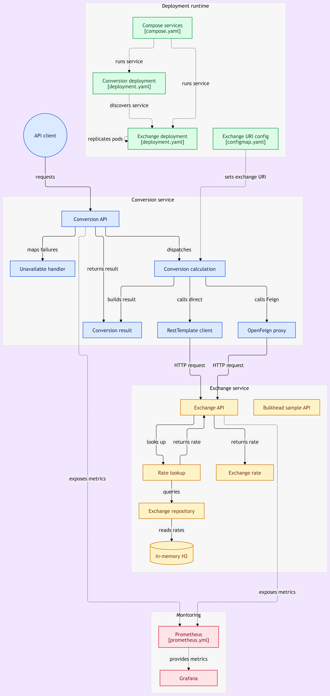

# Currency Exchange Microservices

A small, runnable demonstration of two Spring Boot services communicating through HTTP, packaged with Docker and deployed to Kubernetes.

## What it demonstrates

- The **exchange service** returns seeded exchange rates from an in-memory H2 database.
- The **conversion service** calculates a total using either a direct RestTemplate call or an OpenFeign client.
- Docker Compose provides service-name DNS for the containerized version.
- Kubernetes provides service-name DNS, routing to exchange replicas, health probes, and replacement of failed pods. There is no Eureka server.
- Automated tests and GitHub Actions verify both services and their Docker builds.
- Prometheus and Grafana provide local metrics monitoring; timeouts and a circuit breaker protect conversion requests during exchange outages.

Both conversion paths use the CURRENCY_EXCHANGE_URI setting as the exchange host (without a port). The application appends port 8000. It defaults to http://localhost for local development, is set to http://exchange in Compose, and to http://currency-exchange in Kubernetes.

## Requirements

- JDK 25 for running the services outside containers
- Docker Desktop and Docker Compose for the container workflow
- Docker Desktop Kubernetes (kind mode) and kubectl for the Kubernetes workflow

Each service has its own Maven wrapper; a separate Maven installation is not required.

## Run locally

In one PowerShell terminal:

~~~powershell
cd .\currency-exchange-service
.\mvnw.cmd clean verify
.\mvnw.cmd spring-boot:run
~~~

In a second terminal, from the repository root:

~~~powershell
cd .\currency-conversion-microservice
.\mvnw.cmd clean verify
.\mvnw.cmd spring-boot:run
~~~

The exchange service listens on port 8000 and conversion on port 8100. Stop these local processes before starting Compose if those ports are in use.

## Run with Docker Compose

From the repository root:

~~~powershell
docker compose up --build -d
docker compose ps
~~~

Compose sets CURRENCY_EXCHANGE_URI to http://exchange, its DNS name for the exchange container. To stop and remove the Compose containers:

~~~powershell
docker compose down
~~~

## Run with Docker Desktop Kubernetes

These steps target Docker Desktop's single-node **kind** cluster on Windows. First enable Kubernetes in Docker Desktop and check that the node is ready:

~~~powershell
kubectl config current-context
kubectl get nodes
~~~

The context should be docker-desktop. Build the local images:

~~~powershell
docker compose build
~~~

Docker Desktop's kind node may not see images built in the host image store. If the images are not already in the node, save them from PowerShell:

~~~powershell
docker image save -o "$env:TEMP\currency-exchange-local.tar" currency-exchange:local
docker image save -o "$env:TEMP\currency-conversion-local.tar" currency-conversion:local
~~~

Then import them with **Command Prompt** (cmd.exe), which preserves the binary stream:

~~~cmd
docker exec -i desktop-control-plane ctr -n k8s.io images import - < "%TEMP%\currency-exchange-local.tar"
docker exec -i desktop-control-plane ctr -n k8s.io images import - < "%TEMP%\currency-conversion-local.tar"
~~~

You can check the result from PowerShell:

~~~powershell
docker exec desktop-control-plane crictl images
kubectl apply -f .\currency-exchange-service\deployment.yaml
kubectl apply -f .\currency-conversion-microservice\deployment.yaml
kubectl rollout status deployment/currency-exchange --timeout=180s
kubectl rollout status deployment/currency-conversion --timeout=180s
kubectl get pods,svc
~~~

The manifests create two exchange replicas, one conversion replica, two internal ClusterIP Services, and a ConfigMap that sets CURRENCY_EXCHANGE_URI to http://currency-exchange. Kubernetes DNS resolves that name to the exchange Service; the Service routes connections to its ready pods. No external load balancer is needed.

After changing Java code, rebuild and re-import the affected image using the commands above, then recreate its pods so they use the new image:

~~~powershell
kubectl rollout restart deployment/currency-conversion
kubectl rollout status deployment/currency-conversion --timeout=180s
~~~

The manifests use a local image tag and imagePullPolicy: IfNotPresent; applying an unchanged manifest alone will not update running pods.

To reach conversion from your computer, run this in one terminal and leave it open:

~~~powershell
kubectl port-forward svc/currency-conversion 18100:8100
~~~

## Try the API

Use port **8100** for local or Compose runs, or **18100** when using the Kubernetes port-forward. The examples below use Kubernetes.

| Endpoint | Purpose |
| --- | --- |
| /currency-exchange/from/USD/to/BDT | Exchange rate; call on the exchange service |
| /currency-conversion/from/USD/to/BDT/amount/100 | Conversion via RestTemplate |
| /currency-conversion-feign/from/USD/to/BDT/amount/100 | Conversion via OpenFeign |

In a second PowerShell terminal:

~~~powershell
Invoke-RestMethod http://localhost:18100/currency-conversion/from/USD/to/BDT/amount/100
Invoke-RestMethod http://localhost:18100/currency-conversion-feign/from/USD/to/BDT/amount/100
~~~

Both conversion endpoints should return a conversionMultiple of 85.41 and a total of 8541.00. The Feign response marks its environment value with "feign"; under Kubernetes, the exchange pod name is also visible there.

To call the exchange endpoint directly in Kubernetes, start a separate port-forward and use port 18000:

~~~powershell
kubectl port-forward svc/currency-exchange 18000:8000
~~~

~~~powershell
Invoke-RestMethod http://localhost:18000/currency-exchange/from/USD/to/BDT
~~~

## Demonstrate scaling and self-healing

The exchange Deployment starts with two replicas. Check the ready pods:

~~~powershell
kubectl get pods -l app=currency-exchange
kubectl describe svc currency-exchange
~~~

The Service should list two endpoints. To demonstrate replacement, choose one exchange pod name from the first command and delete that pod:

~~~powershell
kubectl delete pod NAME_OF_ONE_EXCHANGE_POD
kubectl get pods -l app=currency-exchange
~~~

The Deployment creates a replacement while the surviving pod remains available. Call either conversion endpoint again to verify the same result. A series of calls may show the same exchange pod because an HTTP client can reuse a connection; it does not mean the second replica is absent.

## Tests and CI

The exchange service has a test for a seeded rate. The conversion service tests its calculation and HTTP endpoints, including successful responses and exchange-unavailable responses. Its circuit-breaker tests check both a forced-open breaker and the transition to open after five failed calls; they verify that an open breaker rejects a request without calling the exchange client.

Each service has its own Maven wrapper. Run `.\mvnw.cmd test` from each service directory on Windows, or use `verify` to run the tests as part of a full Maven build. GitHub Actions runs `mvn verify` and builds a Docker image for each service on pushes and pull requests targeting `main` or `master`. The current pipeline verifies builds; it does not publish images or deploy them.

## Observability

Docker Compose also starts Prometheus and Grafana. Both services expose metrics at `/actuator/prometheus`; Prometheus scrapes the exchange service every 15 seconds at `exchange:8000` and the conversion service at `conversion:8100`. With the Compose stack running, open Prometheus at `http://localhost:9090` and Grafana at `http://localhost:3000`. Add Prometheus as a Grafana data source to explore the metrics there; Grafana dashboards are not provisioned by this repository.

Both Kubernetes deployments have liveness and readiness probes; the conversion deployment also has a startup probe. These are separate from Prometheus metrics: probes determine when pods can receive traffic and when they need restarting.

## Handling exchange outages

The conversion service uses a 3-second connection timeout and a 5-second read timeout for both its RestTemplate and OpenFeign calls to exchange. Both paths share one circuit breaker for that downstream service. It uses a five-call window and requires at least five recorded calls; a failure rate of 50% or more opens it. While open, new conversion calls are rejected without contacting exchange. After 10 seconds, it permits two trial calls to check for recovery. Connection failures and open-breaker rejections return HTTP 503 with a consistent error response.

To demonstrate an outage with Compose, first start the stack as described above, then stop exchange and call either conversion endpoint several times:

~~~powershell
docker compose stop exchange
# Call a conversion endpoint from "Try the API" using port 8100; expect HTTP 503.
docker compose start exchange
~~~

After the breaker wait period, successful calls show that conversion has recovered. The automated tests confirm the less visible part of the behavior: once the breaker opens, the conversion service stops calling its exchange client.

## Scope

Rates are intentionally seeded in an in-memory H2 database: USD, EUR, GBP, and SAR to BDT. They reset with the exchange service, and no external rate provider is involved. This project focuses on service-to-service calls and container orchestration rather than live financial data.
